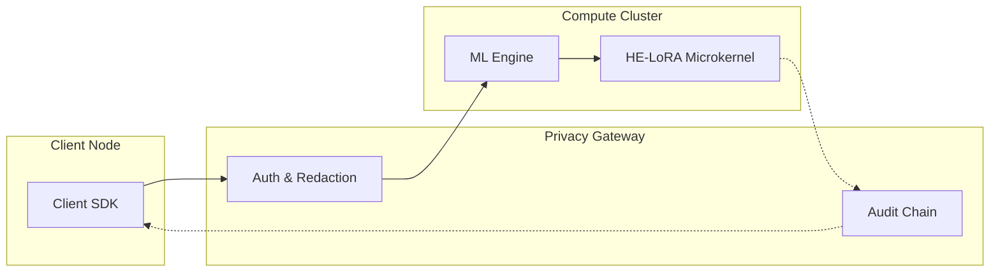

# Training Guide

**Version**: 4.1.0
**Last Updated**: 2026-02-08

This guide covers training workflows and best practices with TenSafe v4.1.

## Training Architecture

TenSafe uses an asynchronous training model where operations are queued and executed on remote compute via a secure middle tier.



## Core Training Primitives

### `forward_backward()`

Computes the forward pass and backpropagates gradients through the model and the encrypted LoRA weights.

```python
from tg_tinker import BatchData

batch = BatchData(
    input_ids=tokens,
    attention_mask=mask,
    labels=labels,
)

# Returns a FutureHandle
future = tc.forward_backward(batch)

# Get result (blocking or async)
result = future.result()
print(f"Loss: {result.loss}")
```

### `optim_step()`

Applies accumulated gradients with the optimizer, incorporating per-sample gradient clipping and noise addition if Differential Privacy is enabled.

```python
opt_future = tc.optim_step(apply_dp_noise=True)
opt_result = opt_future.result()

if opt_result.dp_metrics:
    print(f"Epsilon spent: {opt_result.dp_metrics.epsilon_spent}")
```

---

## v4.1 Features: Security & Verification

### Zero-Rotation (MOAI) Enforcement
When training with HE-LoRA, the system now automatically enforces the Zero-Rotation contract. This ensures that the generated LoRA adapters are compatible with high-speed hardware accelerators that eliminate expensive rotary operations in the encrypted domain.

### Evidence Fabric (TEE Attestation)
All training operations are validated against the **Evidence Fabric**. Before training starts, the compute environment must provide a cryptographic attestation proof (Evidence) that it is running within a Trusted Execution Environment (TEE).

---

## LoRA Configuration

### Basic LoRA Setup

```python
from tg_tinker import LoRAConfig

lora = LoRAConfig(
    rank=16,           # Rank of low-rank matrices
    alpha=32,          # Scaling factor
    target_modules=["q_proj", "v_proj"],
    bias="none"
)
```

## Optimizer Configuration

TenSafe supports several production-grade optimizers:
- `adamw` (Default)
- `adafactor` (Memory efficient)
- `sgd`

## Best Practices

1. **Gradient Accumulation**: Use `gradient_accumulation_steps` to achieve large effective batch sizes while maintaining memory efficiency on encrypted weights.
2. **Regular Checkpointing**: Use `tc.save_state()` frequently. Checkpoints are automatically encrypted (AES-256-GCM) and signed with post-quantum Dilithium3 signatures.
3. **Monitor Privacy Budget**: Always check the cumulative epsilon spent using `tc.get_privacy_report()`.

## Next Steps

- [Ray Distributed Guide](ray-train.md) - For multi-node cluster training.
- [vLLM Integration Guide](vllm-integration.md) - For high-throughput inference with trained adapters.
- [Observability Guide](observability.md) - Setting up monitoring for training runs.
