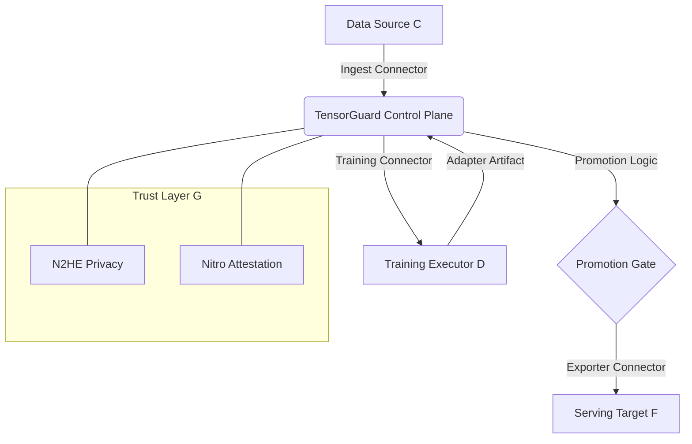

# How It All Connects

The TensorGuardFlow Pipeline Integration Framework is designed to be a "Pluggable Control Plane". It manages the lifecycle of your models across different 3rd-party tools without being locked into any single vendor.

## Architecture Diagram

## Key Components

### 1. The Integration Manager
The `IntegrationManager` is the central registry. It loads a tenant's "Integration Profile" and dynamically instantiates the correct **Connectors**.

### 2. Connectors vs. Exporters
- **Connectors**: Active adapters that perform operations (e.g., `LocalFilesystemConnector.health_check()`).
- **Exporters**: Special connectors that generate infrastructure specs (e.g., `K8sJobExporter` generates YAML). TensorGuardFlow prioritizes *Exporting* specifications over *Managing* clusters to maintain a clean boundary.

### 3. Serving Packs
When an adapter is promoted to `STABLE`, the orchestrator uses a **Serving Exporter** (like vLLM) to generate a **Serving Pack**. This pack is the final bridge between the model registry and the production inference engine.

## The Evidence Chain (TGSP)
Every integration activity is recorded in the Continuous Registry:
1. **Config Update**: A snapshot of the integration environment is taken.
2. **Ingest/Train**: Connectors provide capability fingerprints.
3. **Promotion**: Serving pack URIs are logged as final evidence of "infrastructure readiness".

This ensures that the **TensorGuard Security Profile (TGSP)** contains not just model metrics, but also the "Infrastructure Signature" of where the model was built and where it is going.
